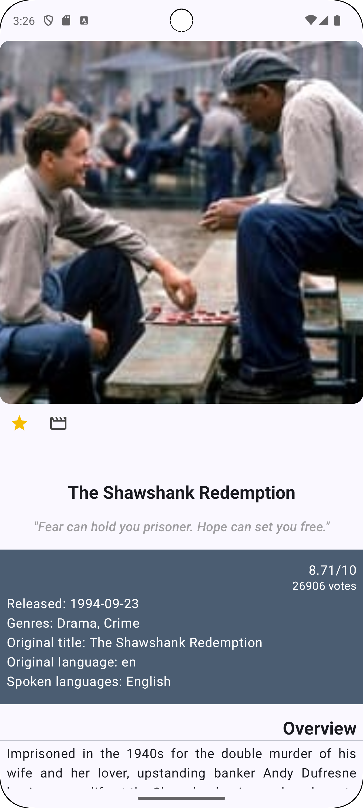

#tmdbCo

|  |  |
| :--- | :--- |
 

With this app, you can check the top rated movies in Spain, mark which ones are your
favorites and which ones you want to see.

I used the following technologies:

- Kotlin.
- MVVM pattern.
- Jetpack Compose.
- Compose Navigation.
- Coroutines.
- StateFlow.

I did use the following libraries:

- Room, to be able to manage a database.
- Retrofit 2, to be able to retrieve json data.
- GSON, to be able to parse retrieved data.
- Hilt, to be able to inject dependencies.
- Coil, to load images efficiently.
- Arrow, to be able to use Eithers.

I used **jUnit5**, **Mockito** and **turbine** to test *viewModels* and both *data* and *domain* layers.
